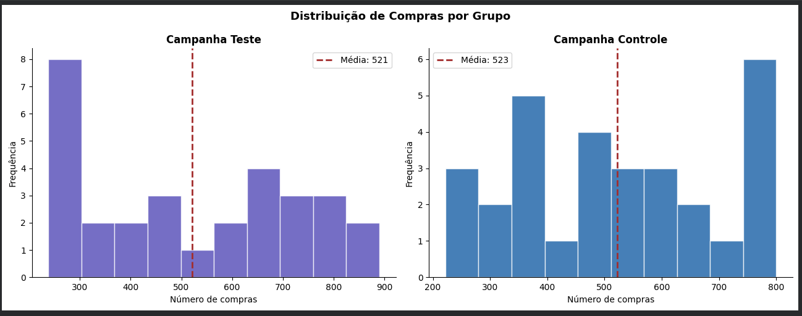
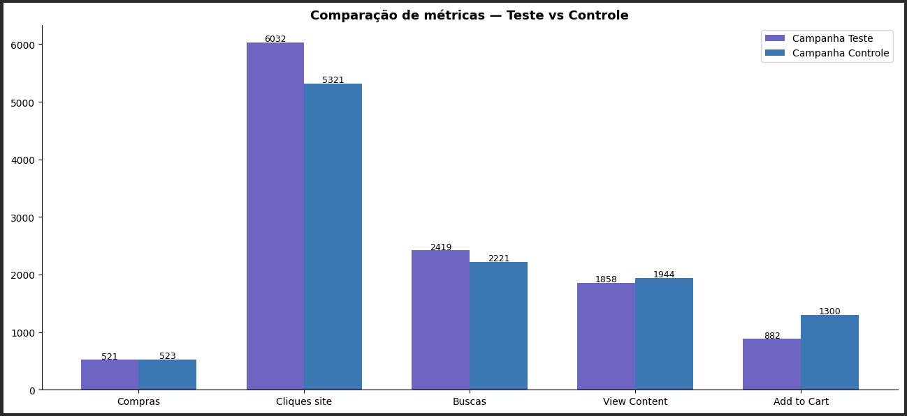

# 📊 Teste A/B — Campanhas de Marketing (Frequentista)

## 📌 Problema de negócio

Qual campanha de marketing performa melhor — Teste ou Controle?
Análise completa com validação estatística (t-test) e métricas de negócio:
custo por compra, taxa de conversão, ROI, CPC e taxa de abandono de carrinho.

## 🔑 Resultados principais

| Métrica | Teste | Controle | Melhor |
|---|---|---|---|
| Custo por compra | USD 5.90 | USD 5.00 | ✓ Controle |
| Taxa de conversão | 9.23% | 11.42% | ✓ Controle |
| CPC | USD 0.469 | USD 0.490 | ✓ Teste |
| Taxa de abandono | 38.21% | 54.47% | ✓ Teste |
| ROI estimado* | 932% | 1069% | ✓ Controle |

*ROI calculado com receita hipotética de USD 50/compra.

## 📊 Visualizações

| Distribuição de Compras | Comparação de Métricas |
|---|---|
|  |  |

## 🧠 Metodologia
